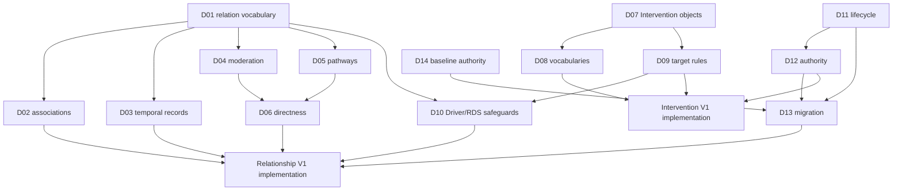

# PSYWERX Relationship + Intervention Architecture V1 Decision Package

**Status:** Proposed decisions for explicit governance review

**Baseline:** Commit `dfa4a854a580e1470abfd62a306cbce3412f0074`,
Relationship Schema V3, the v0.3 migration artifacts and CI protections (with
their explicit non-authoritative preview designation retained), and the
existing `docs/governance/` architecture package

**Authority:** Every recommendation below is non-authoritative. No value becomes
canonical until an authorized governance decision approves the exact rule.

**Review finding:** PR #11 correctly separates the current governed state from
the proposed architecture and limits its changes to documentation and draft
schemas. Its unresolved choices are material enough that implementation should
remain blocked until D01–D14 are adjudicated. This package narrows those choices
without modifying the baseline proposal, production schemas, or scientific
records.

## Decision table

| ID | Governance Decision | Recommended Option | Compatibility Risk | Governance Decision |
| --- | --- | --- | --- | --- |
| D01 | Relation-family vocabulary | Seven top-level families; predicate is the subtype; pathways are separate | Medium | `PENDING` |
| D02 | Association records | First-class symmetric noncausal Relationship records | Low | `PENDING` |
| D03 | Temporal-transition records | First-class noncausal records for reusable sequence claims; causal lag remains edge metadata | Low | `PENDING` |
| D04 | Moderation representation | Normalized n-ary Moderation assertion targeting one causal edge | Medium | `PENDING` |
| D05 | Mediation and causal pathways | Ordinary causal edges plus a separately governed CausalPathway assertion | Medium | `PENDING` |
| D06 | Directness semantics | Deprecate the overloaded field; add causal-claim role and evidence estimand | High | `PENDING` |
| D07 | Canonical Intervention architecture | Intervention and InterventionEffect objects; Package as a governed Intervention subtype | Medium | `PENDING` |
| D08 | Intervention vocabulary | Adopt the minimum controlled vocabularies specified below | Medium | `PENDING` |
| D09 | Intervention target rules | Absolute V1 prohibition on direct RDS targets; no exceptions | Medium | `PENDING` |
| D10 | Driver/RDS causal safeguards | Standard, heightened, and exceptional endpoint review gates | High | `PENDING` |
| D11 | Lifecycle vocabulary | Six lifecycle states plus separate activation and block fields | High | `PENDING` |
| D12 | Governance authority | Human-only governance/activation; automation limited to candidate capture, validation, and approved execution | High | `PENDING` |
| D13 | V3 to V1 migration behavior | Lossless, ID-stable projection with nulls and dual-version compatibility | High | `PENDING` |
| D14 | `NON_AUTHORITATIVE_MIGRATION_PREVIEW` | Retain now; replace only through a separate baseline-adoption decision | High | `PENDING` |

## Decision D01 — Relation-family vocabulary

### 1. Current V3 behavior

The generated V3 artifact uses `CAUSAL`, `DERIVATIONAL`, `COMPOSITIONAL`,
`REALIZATION`, and `SEMANTIC_MAPPING`. The V3 documentation instead mentions
`CAUSAL`, `SEMANTIC`, `DERIVATIONAL`, `REALIZATION`, and `CONSTRAINT`.
`CONSTRAINS` is actually used as a causal predicate, not as a current top-level
family. V3 has no active association, temporal-transition, or moderation
records; mediation is partially encoded by `directness: MEDIATED_PATH` on
ordinary causal segments.

### 2. Proposed V1 behavior

Adopt seven top-level families:

1. `CAUSAL`
2. `EMPIRICAL_NONCAUSAL`
3. `MODERATION`
4. `DERIVATIONAL`
5. `COMPOSITIONAL`
6. `REALIZATION`
7. `SEMANTIC`

Use `predicate` as the precise relationship subtype. Do not add a second
`relationshipSubtype` field. Mediation/pathway participation is represented by
a separate `CausalPathway` object. Measurement remains in Operationalizations.
Generic dependency/prerequisite claims resolve to an existing family or an
InterventionEffect prerequisite rather than creating a `DEPENDENCY` family.

### 3. Why the change is needed

The implemented/documented vocabulary drift must be resolved before Family
audits create more records. Noncausal empirical claims need a canonical home so
they are not promoted to causal edges. Moderation needs different endpoint
semantics. At the same time, top-level families should correspond to distinct
machine treatment rather than every conceivable scientific nuance.

### 4–5. Alternatives considered

| Alternative | Advantages | Disadvantages |
| --- | --- | --- |
| Keep current generated five families | Lowest migration cost; preserves known consumers | Cannot represent association, temporal order, or moderation cleanly; retains documentation drift |
| One generic `NONCAUSAL` family | Very small vocabulary | Collapses calculation, membership, realization, semantics, and empirical observation that require different validation |
| Eleven or more concept-specific families | Highly explicit labels | Unnecessary schema breadth; encourages sparse, inconsistent types and practitioner confusion |
| **Recommended seven families** | Each family changes validation/traversal semantics; preserves current distinctions; adds only genuine gaps | Requires a controlled mapping from current `SEMANTIC_MAPPING` and new tagged-union validation |

### 6. Compatibility/migration implications

`CAUSAL`, `DERIVATIONAL`, `COMPOSITIONAL`, and `REALIZATION` retain their names.
`SEMANTIC_MAPPING` maps structurally to `SEMANTIC` with the existing predicate
unchanged. No current record maps to `EMPIRICAL_NONCAUSAL` or `MODERATION`
without a new governed claim. `CONSTRAINT` is retired as a documented family;
`CONSTRAINS` remains a causal predicate. V3 remains available through an
adapter/archive during migration.

### 7. Risks of a wrong decision

Too few families will allow noncausal dependencies into causal traversal. Too
many will cause low agreement, duplicate propositions, and unusable filters.
Treating mechanism, functional form, or evidence grade as relationship type
would mix scientific content with graph semantics.

### 8. Recommended option

Approve the seven-family vocabulary and make `predicate` the single subtype
field.

### 9. Exact proposed canonical rule/vocabulary/schema semantics

| Family | Allowed V1 predicates | Machine semantics |
| --- | --- | --- |
| `CAUSAL` | `CAUSES`, `ENABLES`, `CONSTRAINS` | Directed; potentially executable only when governed and eligible |
| `EMPIRICAL_NONCAUSAL` | `ASSOCIATED_WITH`, `PRECEDES`, `TRANSITIONS_TO` | Never causal traversal; subtype-specific empirical fields required |
| `MODERATION` | `MODERATES` | N-ary assertion targeting one causal relationship ID |
| `DERIVATIONAL` | `DERIVED_FROM` | Calculation/dependency traversal only; RDS is the subject |
| `COMPOSITIONAL` | `CONSTITUENT_OF`, `MEMBER_OF` | Membership/part graph only; no causal polarity |
| `REALIZATION` | `REALIZES` | Lower-level instantiation; no automatic causal implication |
| `SEMANTIC` | `EQUIVALENT_UNDER_CONDITIONS`, `NARROWER_THAN`, `BROADER_THAN`, `OVERLAPS_WITH`, `INVERSE_UNDER_ALIGNED_SCOPE`, `RELATED_METRIC` | Semantic reconciliation only |

- `relationFamily` determines endpoint schema, validation, and traversal class.
- `predicate` is the relationship subtype and gives the exact proposition.
- `mechanism` explains the process by which a causal or moderation effect
  operates; it is not a type label.
- `functionalForm` describes the shape of change over source values; it is not
  a type label or evidence grade.
- evidence characterization lives in linked EvidenceAssessment records and
  never changes the relation family by itself.
- Aggregation is an RDS `derivationType`, not a family.
- Mediation is a CausalPathway assertion, not a family or predicate.
- Measurement/indicator linkage remains in Operationalizations in V1.
- A prerequisite that changes whether an effect can occur is `ENABLES` or
  `CONSTRAINS` if causal evidence exists; a calculation input is
  `DERIVED_FROM`; an implementation prerequisite is an InterventionEffect
  field. Otherwise it remains narrative research metadata.

**Governance Decision:** `PENDING` — select `APPROVE / MODIFY / REJECT`.

## Decision D02 — Association records

### 1. Current V3 behavior

V3 has no canonical association family. Empirical covariation must currently be
left outside the relationship artifact, described narratively, or risk being
misstated as causal.

### 2. Proposed V1 behavior

Allow first-class, governed, noncausal Relationship records with
`relationFamily: EMPIRICAL_NONCAUSAL` and `predicate: ASSOCIATED_WITH`.
Association is symmetric in V1; endpoint order is only the canonical storage
order.

### 3. Why the change is needed

Family reviews will encounter scientifically useful evidence that supports
covariation but not intervention-based causal direction. A first-class
noncausal representation preserves that evidence and prevents causal inflation.

### 4–5. Alternatives considered

| Alternative | Advantages | Disadvantages |
| --- | --- | --- |
| Exclude associations entirely | Simplest causal graph | Loses useful evidence and pressures reviewers to overclaim or discard it |
| Store only in source/evidence notes | No new relationship type | Hard to query, compare, deduplicate, or show practitioners |
| Permit directed `PREDICTS` associations in V1 | Represents regression direction | Easily mistaken for causality; direction can be model/design-specific |
| **First-class symmetric association** | Explicitly useful and explicitly noncausal; simple validation | Does not encode every predictive model; adds a noncausal graph collection |

### 6. Compatibility/migration implications

This is additive. No V3 causal or semantic record is automatically converted.
Candidate associations receive new permanent IDs. Consumers that only traverse
`CAUSAL` remain unaffected.

### 7. Risks of a wrong decision

Excluding association can inflate causal claims. Allowing weak or mechanically
induced associations can flood the graph. Directed association may be consumed
as causation. RDS pairs with shared constituents can show guaranteed
covariation that is derivational rather than empirical.

### 8. Recommended option

Approve symmetric first-class association records with a meaningful-evidence
and non-derivationality gate. Defer directed predictive associations.

### 9. Exact proposed canonical rule/vocabulary/schema semantics

- Allowed endpoint combinations: Driver–Driver, Driver–RDS, and RDS–RDS.
  Endpoint types must resolve exactly. The stored IDs are ordered
  lexicographically to prevent duplicate inverse records.
- `symmetry` is fixed to `SYMMETRIC`; causal `polarity`, causal `directness`,
  causal lag, and causal mechanism are null/not applicable.
- Required: ID, endpoints/types, scope, association measure class or qualitative
  association statement, temporal scope, EvidenceAssessment, sources,
  governance/revision provenance, and `causalClaim: false`.
- Association strength is optional and structured in EvidenceAssertion as
  metric, estimate, scale/unit, uncertainty interval, model/design, population,
  and period. It is never a generic graph weight.
- `temporalScope` is one of `CROSS_SECTIONAL`, `CONTEMPORANEOUS_LONGITUDINAL`,
  `REPEATED_MIXED`, or `NOT_ESTABLISHED`. Evidence of precedence uses D03
  instead.
- An association involving an RDS must pass a constituent-overlap check. If the
  association is entailed by a formula, denominator, shared input, or semantic
  definition, use derivational or semantic representation instead.
- At least one resolvable source and an evidence rationale are required for a
  governed record. Confounding, measurement coupling, selection, and reverse
  causation limitations must be stated.
- Association and causal records may coexist for the same entity pair because
  they assert different propositions. They use different IDs, link through
  `relatedRelationshipIds`, retain their own scopes/evidence, and cannot both
  contribute weights to one causal computation.

**Governance Decision:** `PENDING` — select `APPROVE / MODIFY / REJECT`.

## Decision D03 — Temporal-transition records

### 1. Current V3 behavior

V3 stores lag fields on causal edges but has no first-class noncausal temporal
predicate. Path order can be inferred from directed causal segments, but “A
precedes B” cannot be represented without suggesting causality or leaving the
graph.

### 2. Proposed V1 behavior

Use first-class `EMPIRICAL_NONCAUSAL` relationships with predicates `PRECEDES`
and `TRANSITIONS_TO` for reusable temporal propositions. Keep causal onset lag
on the causal evidence/profile and sequence within a governed CausalPathway.

### 3. Why the change is needed

Temporal order is necessary but insufficient for causality. Preserving it as a
noncausal proposition supports longitudinal research, state models, and
scenario analysis without overstating evidence.

### 4–5. Alternatives considered

| Alternative | Advantages | Disadvantages |
| --- | --- | --- |
| Causal-edge metadata only | No new records | Cannot represent noncausal precedence or observed transitions |
| Pathway metadata only | Keeps sequence with mechanisms | Requires causal edges and cannot represent standalone noncausal sequences |
| Generic temporal family separate from other empirical records | Very explicit | Adds a top-level family with the same noncausal traversal treatment |
| **Empirical noncausal temporal predicates** | First-class and queryable while sharing a noncausal family | Requires subtype-specific validation and careful UI labels |

### 6. Compatibility/migration implications

This is additive. Existing causal `lagProfile`, bounds, unit, and narrative are
not converted into temporal relationships. New records require new IDs and
evidence. Consumers must filter by family/predicate.

### 7. Risks of a wrong decision

Temporal records may be read as causes, transition probabilities may be
generalized outside their risk set/horizon, and duplicated causal-lag records
may double count one fact. Omitting them loses meaningful state progression.

### 8. Recommended option

Approve first-class noncausal precedence and transition records only when the
sequence is a reusable scientific proposition rather than a detail of one
causal study or pathway.

### 9. Exact proposed canonical rule/vocabulary/schema semantics

- `PRECEDES`: source state is observed earlier than target more often or more
  reliably than a declared comparison, without a causal assertion.
- `TRANSITIONS_TO`: units in a declared source state enter a declared target
  state over a specified horizon/risk set, without a causal assertion.
- Both are directed and require `causalClaim: false`, observation unit,
  source/target state definitions, time origin, observation window/horizon,
  lag band or distribution description, population/system, context, evidence
  rationale, sources, uncertainty, and governance provenance.
- Transition probability is optional. If populated, it requires numerator,
  denominator/risk set, horizon, censoring/competing-state treatment, estimate,
  and uncertainty interval. A qualitative `TRANSITIONS_TO` claim must not
  imply a probability.
- `PRECEDES` does not permit causal polarity. `TRANSITIONS_TO` may use a
  transition label but not positive/negative causal sign.
- A temporal record may coexist with a causal edge using a different ID and
  evidence. It is never included in causal traversal or FCM weights.
- Timing specific to A's causal effect on B remains causal-edge evidence;
  timing that orders multiple edges remains pathway metadata.

**Governance Decision:** `PENDING` — select `APPROVE / MODIFY / REJECT`.

## Decision D04 — Moderation representation

### 1. Current V3 behavior

V3 provides `moderatorEntityIds` on a causal relationship and reserves
`objectRelationshipId`, but all 431 current causal records have empty moderator
ID lists. Current validators require an entity object even when a relationship
object is contemplated, so edge-targeted moderation is not fully representable.
Legacy V2 allows the predicate `MODERATES`, but no active causal record uses it.

### 2. Proposed V1 behavior

Represent moderation as a normalized n-ary `MODERATION` Relationship variant
that targets exactly one governed causal relationship and names one or more
moderator entities. It is neither an ordinary M→B edge nor an inline list with
no effect semantics.

### 3. Why the change is needed

“The effect of A on B changes as M changes” is a claim about an edge and at
least three entities. An inline ID list cannot represent direction, range,
joint moderators, evidence, or revision. An ordinary causal edge changes the
scientific meaning.

### 4–5. Alternatives considered

| Alternative | Advantages | Disadvantages |
| --- | --- | --- |
| Inline moderator IDs on causal edge | Simple lookup; current field exists | Cannot independently evidence/version the claim or express direction/ranges/joint effects |
| Ordinary M→B or M→A edges | Uses existing binary graph | Scientifically wrong unless separate causal claims exist |
| General hyperedge for every relationship | Maximally expressive | Large implementation and practitioner complexity for a rare structure |
| **Normalized Moderation assertion** | Exact edge target, independent evidence/version, supports multiple moderators | Requires a tagged relationship schema and edge-to-edge references |

### 6. Compatibility/migration implications

Existing narrative `conditionsModerators` remains unchanged. Existing
`moderatorEntityIds` may seed candidates but cannot be promoted automatically.
No current record needs transformation because all lists are empty. The V1
schema must allow a relationship object target without an entity object.

### 7. Risks of a wrong decision

Flattening moderation produces false causal edges. Unbounded moderator values
make simulations uninterpretable. Combining independent moderators into a
joint assertion can imply unsupported interactions; splitting true joint
moderation loses its meaning.

### 8. Recommended option

Approve the normalized Moderation assertion as a Relationship record variant.

### 9. Exact proposed canonical rule/vocabulary/schema semantics

- Required fields: `id`, `relationFamily: MODERATION`, `predicate: MODERATES`,
  `moderatedRelationshipId`, `moderatorSpecifications`, `moderationDirection`,
  mechanism, conditions, population/context, EvidenceAssessment, and
  governance/revision provenance.
- `moderatedRelationshipId` must resolve to one governed `CAUSAL` relationship.
- `moderatorSpecifications` contains one or more unique canonical Driver or RDS
  IDs plus governed ranges/states and scale interpretation. RDS moderators must
  satisfy D10 and cannot be exogenous in an executable model.
- `combinationRule` is `INDIVIDUAL` for one moderator or `JOINT` for an
  evidence-supported interaction among multiple moderators. Independently
  acting moderators use separate assertions.
- `moderationDirection` is one of `AMPLIFIES`, `ATTENUATES`, `REVERSES`,
  `NON_MONOTONIC`, or `CONTEXT_DEPENDENT`.
- Multiple assertions may target the same causal edge. Duplicate moderator
  set/edge/scope combinations are prohibited.
- The assertion is executable only if the moderated edge is active and the
  moderator state/range is available. Otherwise it remains canonical but
  non-executable.
- Moderation never creates an ordinary M→A or M→B edge. Such edges require
  their own causal evidence and IDs.

**Governance Decision:** `PENDING` — select `APPROVE / MODIFY / REJECT`.

## Decision D05 — Mediation and causal pathways

### 1. Current V3 behavior

V3 stores ordinary causal edges and uses `MEDIATED_PATH` in `directness` for 39
current records, including path segments. There is no pathway ID or governed
assertion that particular segments jointly constitute mediation.

### 2. Proposed V1 behavior

Represent A→M and M→B as ordinary governed causal edges. Add a separate
governed `CausalPathway` assertion only when evidence supports their ordered
joint interpretation. Do not create a special A→B mediation edge.

### 3. Why the change is needed

Two plausible edges do not prove mediation. A pathway needs evidence for
temporal order and transmitted effect. Separating it prevents an indirect
shortcut from being counted alongside its segments.

### 4–5. Alternatives considered

| Alternative | Advantages | Disadvantages |
| --- | --- | --- |
| Infer all paths from graph adjacency | No new object | Mistakes reachability for mechanism/mediation |
| Special `MEDIATES` A→B edge | Easy display | Hides the mediator and duplicates source-to-outcome influence |
| Encode pathway only, without ordinary edges | Compact pathway | Prevents independent reuse/evidence of segments |
| **Edges plus governed pathway assertion** | Separates segment evidence from mediation evidence; reusable and machine-readable | Adds a second governed object and chain validation |

### 6. Compatibility/migration implications

Existing causal IDs remain stable. Existing `MEDIATED_PATH` values do not
automatically create pathway assertions. They require review under D06; current
V3 behavior remains available until then.

### 7. Risks of a wrong decision

Automatically inferred pathways overstate mechanisms. A shortcut plus segments
can duplicate causal contribution. “Full mediation” can be generalized beyond
the studied context, and edge scopes may not align.

### 8. Recommended option

Approve a separate governed CausalPathway object composed only of governed
causal edge IDs.

### 9. Exact proposed canonical rule/vocabulary/schema semantics

- Required: pathway ID/revision, ordered unique causal relationship IDs,
  mediator specifications, start/end entity IDs, aligned population/context,
  temporal-order rationale, pathway-specific evidence rationale/sources,
  mediation classification, uncertainty/conflicts, and governance provenance.
- Every consecutive pair of edges must be contiguous: the prior object entity
  equals the next subject entity. Every constituent edge must be governed
  causal knowledge; inactive edges make the pathway non-executable.
- Each intermediate entity has a role: `MEDIATOR` or
  `MECHANISTIC_INTERMEDIATE`. Covariates and moderators are not pathway nodes
  unless they also occupy a causal segment.
- `mediationClassification` is `PARTIAL`, `FULL`, or `UNDETERMINED`. `FULL`
  requires explicit context-specific evidence that the residual direct effect
  is not supported; it is never inferred from a nonsignificant estimate alone.
- Pathway evidence must support transmitted/mediated interpretation; evidence
  for individual edges is necessary but not sufficient.
- A separately estimated source-to-outcome relationship may coexist only as a
  `TOTAL_EFFECT` claim under D06. Executable model packages must select path
  propagation, total-effect use, or an explicit reconciliation method; they may
  not count both blindly.
- A pathway is annotation/analysis structure, not another causal influence in
  degree counts or FCM adjacency.

**Governance Decision:** `PENDING` — select `APPROVE / MODIFY / REJECT`.

## Decision D06 — Directness semantics

### 1. Current V3 behavior

V3 uses one causal field, `directness`, with `DIRECT_AT_STATED_RESOLUTION`,
`MEDIATED_PATH`, or `UNKNOWN`. Of the 431 governed active causal records, 39
are marked `MEDIATED_PATH`; the value appears on individual path segments as
well as records that may be intended as summarized influences. It therefore
does not consistently distinguish mechanistic directness, a statistical
estimand, graph adjacency, or the absence of a represented intermediate.

### 2. Proposed V1 behavior

Deprecate `directness` as a V1 scientific field and split its meanings. Put
the role of a stored causal claim in core Relationship, the estimated effect
type in EvidenceAssertion, and mechanistic directness only in evidence or a
governed pathway assertion. Treat graph adjacency as a computed property.

### 3. Why the change is needed

An edge is always adjacent in the stored graph, but may summarize a total
effect, omit an unknown intermediate, or estimate a direct effect conditional
on measured mediators. Calling all of these “direct” changes model behavior
and can cause a shortcut edge to be counted with its pathway.

### 4–5. Alternatives considered

| Alternative | Advantages | Disadvantages |
| --- | --- | --- |
| Retain V3 unchanged | No migration | Continues four-way ambiguity and duplicate-counting risk |
| Rename to `graphDirectness` | Small change | Graph adjacency is already derivable and says nothing scientific |
| One expanded directness enum | One field | Still combines proposition role, mechanism, and statistical estimand |
| **Split the meanings** | Precise, model-safe, evidence-aware | Requires compatibility fields and review of ambiguous V3 values |

### 6. Compatibility/migration implications

All V3 values remain available as `legacyDirectness`. No V3 value is used to
infer mechanistic directness or an estimand. `DIRECT_AT_STATED_RESOLUTION` may
be provisionally projected as `LOCAL_LINK` only where the proposition is
unchanged; the 39 `MEDIATED_PATH` records remain V1-incomplete until reviewed.
V3 readers continue to receive the old field during dual-version operation.

### 7. Risks of a wrong decision

Collapsing total and local effects permits double counting. Equating an
estimated controlled direct effect with a mechanistically direct process
overstates knowledge. Treating omitted intermediates as evidence of
directness makes graph resolution look like scientific certainty.

### 8. Recommended option

Approve the split and deprecate, but do not delete, the V3 field during the
compatibility period.

### 9. Exact proposed canonical rule/vocabulary/schema semantics

- Core causal Relationship requires `causalClaimRole`: `LOCAL_LINK`,
  `TOTAL_EFFECT`, or `UNRESOLVED_SHORTCUT`.
- `LOCAL_LINK` means the relationship is intended as one modeled causal link
  at the declared ontology resolution. It does not assert biological or
  mechanistic immediacy.
- `TOTAL_EFFECT` means the relationship represents a source-to-target total
  effect that may include transmitted paths. A model must not use it together
  with constituent paths without an explicit reconciliation rule.
- `UNRESOLVED_SHORTCUT` means a causal proposition is retained but known or
  suspected intermediates have not been represented sufficiently for safe
  propagation. It is canonical but non-executable by default.
- EvidenceAssertion uses `estimandType`: `DIRECT_EFFECT`, `INDIRECT_EFFECT`,
  `TOTAL_EFFECT`, `OTHER`, or `NOT_ESTIMATED`.
- EvidenceAssertion may state `mechanisticDirectness`: `DIRECT`, `INDIRECT`,
  or `UNKNOWN`, but only when the evidence supports that interpretation.
- Graph adjacency means only that a stored relationship has those endpoints;
  it is computed and is never stored as scientific directness.
- `legacyDirectness` is read-only migration provenance and must not control V1
  calculations.

**Governance Decision:** `PENDING` — select `APPROVE / MODIFY / REJECT`.

## Decision D07 — Canonical Intervention architecture

### 1. Current V3 behavior

Relationship Schema V3 has no Intervention object. The proposed architecture
documents distinguish a reusable intervention identity from contextual target
effects and contemplate packages, but no production schema or data exists.

### 2. Proposed V1 behavior

Create two top-level record types: `Intervention` and `InterventionEffect`.
Represent an InterventionPackage as an `Intervention` with
`interventionKind: PACKAGE` and governed component specifications, rather than
as a third catalog type. Package-level effects remain separate
InterventionEffect records and require their own evidence.

### 3. Why the change is needed

“What action exists?” is stable identity; “what does it do to this target for
this population and context?” is a contingent scientific assertion. Combining
them duplicates intervention identities across targets and contexts. Packages
need composition semantics, but a third root type offers little V1 benefit.

### 4–5. Alternatives considered

| Alternative | Advantages | Disadvantages |
| --- | --- | --- |
| One Intervention record containing targets/evidence | Simple initial schema | Duplicates identity and cannot cleanly represent conflicting contextual effects |
| Intervention as a Relationship subtype | One graph artifact | Confuses an action with a scientific effect assertion |
| Three independent top-level types | Explicit package catalog | Additional IDs, APIs, and lifecycle with little semantic gain |
| **Two objects; package is Intervention subtype** | Normalized effects and reusable composition with minimal types | Tagged Intervention validation is required |

### 6. Compatibility/migration implications

This is additive: there are no canonical intervention records to migrate.
Existing narrative methods material may seed only candidate records. No
Intervention or InterventionEffect becomes governed through import or schema
validation.

### 7. Risks of a wrong decision

Putting effects on identity records makes context-specific claims look
universal. Treating packages as ungoverned lists hides dose, sequence, and
interaction. Treating package effects as the sum of component effects may
invent efficacy or double count evidence.

### 8. Recommended option

Approve Intervention and InterventionEffect as first-class objects, with
Package as a governed Intervention subtype in V1.

### 9. Exact proposed canonical rule/vocabulary/schema semantics

- `Intervention` answers what action/manipulation exists. Required identity
  fields are stable ID/revision, canonical name, description, kind, category,
  identity provenance, and governance state.
- `InterventionEffect` answers what one Intervention is expected or observed
  to do to exactly one governed target under declared conditions. It owns
  target, effect mode/direction, mechanism, scope, effect evidence, risk, and
  governance provenance.
- An `ATOMIC` Intervention has no components. A `PACKAGE` Intervention has two
  or more unique component Intervention IDs, component roles, and, when
  governed, ordering/concurrency and required/optional status.
- Package components must resolve to governed Interventions and may not create
  direct or indirect composition cycles.
- Component InterventionEffects do not imply a package effect. A package-level
  InterventionEffect uses the package ID and independent or explicitly
  synthesized evidence.
- A governed Intervention identity may be `INACTIVE`, but it must have at
  least one governed InterventionEffect before it can be `ACTIVE` for
  recommendation or scenario use.

**Governance Decision:** `PENDING` — select `APPROVE / MODIFY / REJECT`.

## Decision D08 — Intervention vocabulary

### 1. Current V3 behavior

There is no canonical intervention vocabulary. Existing prose discusses
methods and operationalization but does not provide governed enums usable for
validation or comparison.

### 2. Proposed V1 behavior

Adopt small controlled vocabularies for identity, target/effect semantics,
delivery and scope, while keeping scientific evidence, confidence, and
governance orthogonal. Permit `OTHER_SPECIFIED` only where a required
explanation is stored; do not use it as a default.

### 3. Why the change is needed

The audit needs consistent terms for exact target and direction without
forcing every domain into a behavior-change taxonomy. Parsimony preserves
practitioner usability and leaves external taxonomies as crosswalks.

### 4–5. Alternatives considered

| Alternative | Advantages | Disadvantages |
| --- | --- | --- |
| Uncontrolled text | Fast, expressive | Not reliably searchable, comparable, or validatable |
| Import an external technique taxonomy | Ready-made detail | Violates Driver-first organization and may omit policy, technology, or environmental action |
| Large PSYWERX taxonomy in V1 | Fine-grained analytics | Premature distinctions, sparse evidence, high maintenance |
| **Small enums plus narrative detail/crosswalks** | Machine-readable and extensible | Some early records require `OTHER_SPECIFIED` or later refinement |

### 6. Compatibility/migration implications

The vocabulary is additive. Future enum changes must use explicit aliases and
schema versions; existing codes may not be silently reinterpreted. External
taxonomy terms remain namespaced crosswalks, not canonical categories.

### 7. Risks of a wrong decision

Overlapping direction and effect-mode codes create inconsistent records.
Categories that privilege Psychological/Social methods bias coverage.
Combining evidence and confidence obscures whether disagreement reflects poor
studies or uncertain synthesis.

### 8. Recommended option

Approve the following minimum vocabularies, subject to D11 for lifecycle.

### 9. Exact proposed canonical rule/vocabulary/schema semantics

| Field | Canonical V1 values |
| --- | --- |
| `interventionKind` | `ATOMIC`, `PACKAGE` |
| `category` | `COMMUNICATION_OR_INFORMATION`, `TRAINING_OR_SKILL`, `ENVIRONMENTAL_OR_CHOICE_ARCHITECTURE`, `POLICY_RULE_OR_STANDARD`, `INCENTIVE_OR_RESOURCE`, `CONSTRAINT_OR_ENFORCEMENT`, `TECHNOLOGY_OR_CONFIGURATION`, `SERVICE_OR_SUPPORT`, `BIOLOGICAL_OR_CLINICAL`, `OTHER_SPECIFIED` |
| `targetKind` | `DRIVER`, `RELATIONSHIP`, `CONTEXT_CONDITION` |
| `effectMode` | `CHANGE_LEVEL`, `STABILIZE`, `DISRUPT`, `MODIFY_RELATIONSHIP`, `ALTER_CONTEXT` |
| `intendedDirection` | Mode-constrained values below |
| `deliveryModality` | `HUMAN_DELIVERED`, `DIGITAL_OR_AUTOMATED`, `PHYSICAL_ENVIRONMENT`, `ORGANIZATIONAL_OR_POLICY_PROCESS`, `MIXED`, `NOT_APPLICABLE`, `OTHER_SPECIFIED` |
| `scale` | Existing Relationship endpoint-level vocabulary plus `MULTILEVEL` |
| `populationScope` | `UNIVERSAL_WITHIN_SCOPE`, `SUBGROUP_TARGETED`, `INDIVIDUALIZED`, `SYSTEM_OR_NONHUMAN`, `MIXED` |
| `contextScope` | `CORE_REUSABLE`, `CONTEXT_DEPENDENT`, `SCENARIO_SPECIFIC` |
| `evidenceStrength` | `STRONG`, `MODERATE`, `MIXED`, `LIMITED`, `EMERGING`, `NOT_ASSESSED` |
| `confidence` | `HIGH`, `MODERATE`, `LOW`, `NOT_ASSESSED` |

Direction is constrained by effect mode:

- `CHANGE_LEVEL`: `INCREASE`, `DECREASE`, `CONTEXT_DEPENDENT`.
- `STABILIZE`: `MOVE_TOWARD_RANGE`, `MAINTAIN_RANGE`.
- `DISRUPT`: `REDUCE_OR_INTERRUPT`.
- `MODIFY_RELATIONSHIP`: `AMPLIFY`, `ATTENUATE`, `SUPPRESS`, `REVERSE`,
  `CONTEXT_DEPENDENT`.
- `ALTER_CONTEXT`: `INCREASE`, `DECREASE`, `ENABLE`, `CONSTRAIN`,
  `CONTEXT_DEPENDENT`.

`NOT_ASSESSED` is allowed only before governance. `OTHER_SPECIFIED` requires a
nonempty specification. `SCENARIO_SPECIFIC` effects cannot be generalized as
core recommendations without a separate governed synthesis.

**Governance Decision:** `PENDING` — select `APPROVE / MODIFY / REJECT`.

## Decision D09 — Intervention target rules

### 1. Current V3 behavior

V3 has no intervention targets. The governed ontology distinguishes 770
Drivers from 41 RDS, but nothing currently prevents future intervention data
from treating a calculated or inferred RDS as an independently manipulable
cause.

### 2. Proposed V1 behavior

Make “RDS cannot be a direct InterventionEffect target” an absolute V1 schema
rule, with no governed exception path. Direct target kinds are Driver,
Relationship, or Context Condition. Edge/context effects must still identify
the mechanistic Driver or Drivers changed when known.

### 3. Why the change is needed

An intervention acts on modifiable inputs, processes, settings, or pathways;
an RDS changes because its constituents or derivation inputs change. An
exception field would become an easy route around the Driver/RDS distinction
before the model has operational experience.

### 4–5. Alternatives considered

| Alternative | Advantages | Disadvantages |
| --- | --- | --- |
| Permit all entity targets | Matches colloquial language | Turns derived outputs into independent levers |
| Permit governor-approved RDS exceptions | Flexible for edge cases | Weakens validation and can bypass needed ontology correction |
| Ban RDS direct targets in V1, allow outcome roles | Clear and model-safe | Requires decomposing familiar outcome labels into true targets |
| Ban any RDS occurrence | Simplest validator | Loses valuable outcomes, MOEs, and pathway reporting |

### 6. Compatibility/migration implications

There is no existing intervention catalog to break. Candidate imports naming an
RDS as target must be decomposed into constituent Driver effects or blocked for
ontology review; the original wording may remain in research provenance. This
rule does not reclassify any entity.

### 7. Risks of a wrong decision

Allowing direct RDS targets creates exogenous derived values, incoherent
recalculation, and duplicate propagation through both a constituent and its
aggregate. An overly broad ban would prevent RDS from serving as legitimate
outcomes and measures.

### 8. Recommended option

Approve the absolute direct-target prohibition for V1 and require separate
governance reconsideration, not a per-record waiver, if evidence exposes a
real counterexample.

### 9. Exact proposed canonical rule/vocabulary/schema semantics

- `InterventionEffect.targetKind: DRIVER` requires a canonical Driver ID and
  may use level-change, stabilize, or disrupt modes.
- `targetKind: RELATIONSHIP` requires one governed causal Relationship ID and
  uses `MODIFY_RELATIONSHIP`; it does not create a new causal entity edge.
- `targetKind: CONTEXT_CONDITION` requires a controlled or explicitly scoped
  condition and uses `ALTER_CONTEXT`. It must link affected causal edges or
  target Drivers where known.
- An RDS ID is invalid in the direct target field in V1. There is no exception
  flag or governor override in the record schema.
- A colloquial goal such as improving Sleep Sufficiency, Readability, or a
  network centrality state is represented by effects on its modifiable
  constituent/configuration Drivers. If no legitimate Driver can be named,
  the effect remains blocked rather than targeting the RDS.
- RDS may appear as `downstreamOutcomeEntityIds`, as the construct assessed by
  a measure of effectiveness, as a derived/recalculated result with an exact
  derivation version, or as a non-exogenous node in an explanatory pathway.
- If something currently classified as RDS is demonstrably a directly
  configurable state, any reclassification is a separate ontology governance
  decision; an InterventionEffect cannot make that decision implicitly.

**Governance Decision:** `PENDING` — select `APPROVE / MODIFY / REJECT`.

## Decision D10 — Driver/RDS causal safeguards

### 1. Current V3 behavior

V3 permits entity endpoints and records their Driver/RDS type but does not
encode endpoint-combination-specific review gates. The v0.3 RDS schema and
migration governance distinguish derived states and derivations, while active
causal content may still contain RDS endpoints that must be preserved pending
review.

### 2. Proposed V1 behavior

Allow all four combinations conditionally, with `STANDARD_CAUSAL`,
`HEIGHTENED_CAUSAL`, and `EXCEPTIONAL_CAUSAL` review gates. Do not encode an
arbitrary publication-count threshold; require progressively stronger
derivation, temporal, mechanistic, and anti-double-counting review.

### 3. Why the change is needed

An RDS may summarize a real prior state that later affects another state, but
it may also merely restate its inputs. A blanket ban loses legitimate dynamic
effects; unrestricted use turns RDS into root causes and produces algebraic
feedback.

### 4–5. Alternatives considered

| Alternative | Advantages | Disadvantages |
| --- | --- | --- |
| Allow all combinations equally | Simple schema | High tautology and double-counting risk |
| Ban every RDS causal endpoint | Strong protection | Excludes temporally realized aggregate-state effects |
| Fixed evidence-grade thresholds | Easy rule | Evidence labels do not test definitional or algebraic independence |
| **Combination-specific review gates** | Evaluates the actual RDS hazard | More governance work and some non-executable records |

### 6. Compatibility/migration implications

No existing endpoint, classification, or causal claim is changed by migration.
Existing governed records retain V3 authority and receive a V1 review-gate
annotation; they may be V1 non-executable until the gate is satisfied. IDs
remain stable unless the proposition itself changes.

### 7. Risks of a wrong decision

An RDS containing its apparent cause can create an instant self-reinforcing
loop. Propagating a constituent effect and an aggregate shortcut can count one
change twice. Conversely, banning all RDS effects can erase real delayed
system-state mechanisms.

### 8. Recommended option

Approve the three review gates and the executable-model safeguards below.

### 9. Exact proposed canonical rule/vocabulary/schema semantics

Every causal record first passes the ordinary causal gate: scoped causal
evidence/rationale, temporal order, plausible mechanism, alternatives and
conflicts, provenance, and explicit governance. Additional rules are:

| Endpoint combination | Allowed? / gate | Required RDS safeguards |
| --- | --- | --- |
| Driver → Driver | Yes; `STANDARD_CAUSAL` | Check latent/operational overlap and temporal order; no RDS-specific derivation check |
| Driver → RDS | Conditional; `HEIGHTENED_CAUSAL` | Trace the target derivation; distinguish an actual causal update from merely being a formula input; align calculation window; prohibit simultaneous constituent and aggregate propagation without reconciliation |
| RDS → Driver | Conditional; `HEIGHTENED_CAUSAL` | RDS must be realized before the effect, mechanism must be independent of its definition, and effect cannot reduce to one constituent already modeled; derivation/version fixed |
| RDS → RDS | Exceptional; `EXCEPTIONAL_CAUSAL` | Both derivations fixed; temporally distinct state realizations; non-tautological transformation mechanism; full shared-constituent/denominator review and explicit governor rationale |

- `derivationCheck` records formula/logic version, input IDs, calculation
  window, and whether the apparent effect is definitionally entailed.
- `temporalIndependence` requires the cause state to be available before the
  effect window; contemporaneous calculation is insufficient.
- `mechanisticIndependence` requires a process beyond “the value is one of the
  target's inputs” or “both values share an input.”
- `constituentOverlapCheck` lists shared inputs, denominators, and semantic
  overlap and gives a pass/fail rationale.
- If an apparent cause/effect is mathematically or conceptually contained in
  the other at the same time point, no causal edge is permitted absent a
  distinct external temporal process. Use derivation, composition, semantic,
  or noncausal association as appropriate.
- An executable graph initializes an RDS only through its governed derivation
  or observed-value provenance. It must choose constituent propagation or an
  aggregate shortcut, or declare a governed reconciliation rule; it cannot
  use both blindly.

**Governance Decision:** `PENDING` — select `APPROVE / MODIFY / REJECT`.

## Decision D11 — Lifecycle vocabulary

### 1. Current V3 behavior

V3 uses `ACTIVE`, `PROPOSED`, and `DEPRECATED` as relationship statuses while
the proposed architecture package lists eight candidate lifecycle terms that
combine research stage, governance outcome, activation, and blocking. There is
no shared production lifecycle for Interventions, InterventionEffects, or
Pathways.

### 2. Proposed V1 behavior

Use six lifecycle states consistently across all four governed object types,
with activation, governance blocking, evidence disposition, confidence, and
decision outcome stored separately.

### 3. Why the change is needed

`GOVERNED_INACTIVE` is both an authority state and runtime status;
`BLOCKED_NEEDS_GOVERNANCE_INPUT` is a condition, not a progression stage.
Orthogonal fields make transitions deterministic and prevent evidence quality
from silently controlling canonical activation.

### 4–5. Alternatives considered

| Alternative | Advantages | Disadvantages |
| --- | --- | --- |
| Keep eight proposed values | One field and familiar workflow labels | Conflates stage, blockage, and activation; awkward transitions |
| Use only draft/active/deprecated | Very simple | Cannot distinguish research, review readiness, or rejection |
| Separate lifecycle schemas per object | Tailored workflows | Inconsistent tooling and authority rules |
| **Six lifecycle states plus orthogonal fields** | Consistent, expressive, auditable | More than one field must be validated |

### 6. Compatibility/migration implications

V3 `PROPOSED` maps only to a non-governed V1 stage after provenance review;
`DEPRECATED` maps to `DEPRECATED` plus `INACTIVE`. V3 `ACTIVE` may map to
`GOVERNED` plus `ACTIVE` only where the record carries existing explicit
governance provenance; the mapping preserves that record-level decision rather
than inferring it from the preview manifest. The old status remains in the V3
view.

### 7. Risks of a wrong decision

If activation is embedded in lifecycle, disabling a record may look like
revoking governance. If evidence quality is a status, new studies may appear
to authorize activation. Excessive workflow states encourage arbitrary or
unreviewable transitions.

### 8. Recommended option

Approve the orthogonal six-state model for Relationships, Interventions,
InterventionEffects, and CausalPathways.

### 9. Exact proposed canonical rule/vocabulary/schema semantics

- `lifecycleStatus`: `CANDIDATE`, `RESEARCH_NEEDED`, `REVIEW_READY`,
  `GOVERNED`, `REJECTED`, `DEPRECATED`.
- `activationStatus`: `NOT_ELIGIBLE`, `ACTIVE`, `INACTIVE`.
  `CANDIDATE`, `RESEARCH_NEEDED`, `REVIEW_READY`, and `REJECTED` require
  `NOT_ELIGIBLE`; `DEPRECATED` requires `INACTIVE`.
- `blockStatus`: `NONE` or `NEEDS_GOVERNANCE_INPUT`. Blocking does not itself
  advance or reverse lifecycle.
- `evidenceDisposition`: `NOT_ASSESSED`, `SUPPORTS`, `MIXED`,
  `CONTRADICTED`, or `INSUFFICIENT`; evidence strength and confidence remain
  separate.
- Governance decision records use outcome `APPROVE`, `MODIFY`, or `REJECT`;
  the outcome is not a lifecycle status.
- A record may be `GOVERNED` and `INACTIVE` without losing canonical history.
  Only `GOVERNED` plus `ACTIVE` is available for default production use.
- `DEPRECATED` is immutable except for metadata corrections; replacement uses
  `supersededById`. Reopening a rejected proposition creates a new candidate
  revision with an explicit link to the rejected decision.

**Governance Decision:** `PENDING` — select `APPROVE / MODIFY / REJECT`.

## Decision D12 — Governance authority

### 1. Current V3 behavior

Current migration protections validate deterministic artifacts and protected
Driver/RDS governance. The architecture prose states that AI may propose but
may not govern; it does not yet provide one canonical transition matrix for
all new object types.

### 2. Proposed V1 behavior

Authorize automated processes and AI to capture candidates, research,
structure, compare, validate, and materialize an already approved decision.
Reserve all transitions into canonical governance, all activation changes,
and deprecation decisions for an authorized governor. Preserve a separate
researcher/reviewer role for evidence preparation and review readiness.

### 3. Why the change is needed

Schema-valid text is not governed science. A transition matrix makes the
boundary enforceable in CI and prevents an AI-generated candidate or a
deterministic migration from becoming active solely because it was committed.

### 4–5. Alternatives considered

| Alternative | Advantages | Disadvantages |
| --- | --- | --- |
| Let automation activate records meeting thresholds | Scalable | Evidence thresholds cannot resolve ontology and scientific judgment |
| Require governor action for every clerical transition | Maximum control | Creates avoidable bottlenecks and obscures substantive decisions |
| Allow reviewers to govern their own records | Faster | Weak separation between preparation and authorization |
| **Layered authority with human-only governance/activation** | Safe, auditable, still automatable | Requires signed decision records and access controls |

### 6. Compatibility/migration implications

Existing CI may continue to generate and compare artifacts, but generation
does not change authority state. Implementing V1 requires transition checks,
decision-record references, and repository protection for governed activation.
It does not require naming particular personnel in the schema.

### 7. Risks of a wrong decision

Over-automation can silently canonize plausible but false relationships.
Under-automation makes reproducible clerical updates impossible. Ambiguous
authority creates records whose activation cannot be reconstructed or audited.

### 8. Recommended option

Approve the following role-neutral transition matrix and require explicit,
resolvable governance decision provenance.

### 9. Exact proposed canonical rule/vocabulary/schema semantics

| From | To | Automated process / AI | Researcher/reviewer | Authorized governor |
| --- | --- | --- | --- | --- |
| none | `CANDIDATE` | May create, always `NOT_ELIGIBLE` | May create | May create |
| `CANDIDATE` | `RESEARCH_NEEDED` | May recommend/structure; no autonomous scientific transition | May transition with rationale | May transition |
| `RESEARCH_NEEDED` | `REVIEW_READY` | May recommend and prepare evidence | May transition with review signoff | May transition |
| `REVIEW_READY` | `RESEARCH_NEEDED` | May flag; no autonomous transition | May return with rationale | May return |
| `REVIEW_READY` | `GOVERNED` | Prohibited unless exactly materializing an already authorized decision | Prohibited | Required |
| `REVIEW_READY` | `REJECTED` | Prohibited unless exactly materializing an already authorized decision | May recommend | Required |
| `GOVERNED` | `ACTIVE` / `INACTIVE` | Prohibited unless exactly materializing an already authorized decision | May recommend | Required |
| `GOVERNED` | `DEPRECATED` | Prohibited unless exactly materializing an already authorized decision | May recommend | Required |

- AI/automation may set validation flags and recommend `blockStatus`, but an
  authorized governor resolves `NEEDS_GOVERNANCE_INPUT` when the resolution
  changes governed meaning.
- Every transition records prior/new state, object ID/revision, actor class,
  rationale, timestamp, source commit, and decision-record ID where required.
- “Materializing an approved decision” means the exact object revision,
  transition, and content hash are named by the authorized record. Automation
  may not broaden, reinterpret, or originate that decision.
- Substantive changes to a governed object create a candidate new revision;
  metadata-only corrections follow a governed correction procedure.

**Governance Decision:** `PENDING` — select `APPROVE / MODIFY / REJECT`.

## Decision D13 — V3 to V1 migration behavior

### 1. Current V3 behavior

The current 431 fully specified active causal Relationship records conform to
V3 and are regenerated deterministically from the v0.3 handoff inputs. V1 is
documentation and draft schema only; no production V1 artifact or adapter
exists.

### 2. Proposed V1 behavior

Use a lossless, ID-stable projection that preserves every governed scientific
value and legacy field, leaves unsupported V1 fields null, records migration
provenance, and exposes V3 and V1-compatible views in parallel. Keep ambiguous
records V3-only or V1-incomplete until research/governance resolves them.

### 3. Why the change is needed

Schema evolution is not permission to reinterpret scientific content. A
projection separates mechanical normalization from new scientific assertions
and permits rollback, reproducibility, and gradual review.

### 4–5. Alternatives considered

| Alternative | Advantages | Disadvantages |
| --- | --- | --- |
| Rewrite all V3 records into complete V1 | Clean cutover | Necessarily invents missing science and threatens IDs |
| Keep V3 forever and apply V1 only to new records | Zero migration | Two semantic regimes and incomplete analysis |
| Create all-new V1 IDs | Clear namespace | Breaks citations, diffs, crosswalks, and provenance |
| **Lossless ID-stable dual-version projection** | Preserves content and supports incremental review | Temporary nulls, compatibility code, and two views |

### 6. Compatibility/migration implications

V3 IDs remain stable when endpoints, family/predicate, polarity, and scoped
scientific proposition are unchanged. Changing any identity-defining element
requires a new ID and supersession link. Legacy readers use a V3 view/adapter;
V1 consumers must tolerate declared migration incompleteness and cannot treat
null as a scientific value.

### 7. Risks of a wrong decision

Inferring V1 fields fabricates evidence and hides uncertainty. Reissuing IDs
breaks audit trails. A premature hard cutover can make ambiguous directness or
RDS edges executable under the wrong semantics.

### 8. Recommended option

Approve the lossless projection and require field-level migration provenance,
compatibility tests, and explicit incompleteness.

### 9. Exact proposed canonical rule/vocabulary/schema semantics

| V3 content | V1 migration rule |
| --- | --- |
| `id`, `revision` | Copy unchanged; add schema/version provenance |
| endpoint IDs/types | Copy exactly; names are derived display snapshots |
| relation family/predicate | Preserve proposition; normalize only according to approved D01 aliases |
| polarity/direction | Copy exactly for causal records |
| `conditionsModerators` | Copy to `legacyConditionsText`; do not parse into assertions automatically |
| `moderatorEntityIds` | Preserve as legacy/candidate linkage only; no governed Moderation assertion inferred |
| functional form `UNSPECIFIED` | V1 null plus retained legacy value |
| exposure `NOT_SPECIFIED` | V1 null plus retained legacy value |
| numeric lag/persistence | Copy only explicit values; retain qualitative lag bands/narrative without manufactured precision |
| evidence strength/confidence/source IDs | Copy values and exact provenance; do not upgrade or synthesize |
| evidence rationale, conflicts, uncertainty | Null unless explicit governed source content exists |
| `directness` | Preserve as `legacyDirectness`; apply D06 only where unambiguous and governed |
| source/legacy relationship IDs | Preserve and add generator, source/target schema, timestamp, commit, and content hash |
| new required V1 fields absent in V3 | Null with `migrationCompleteness: INCOMPLETE` and named `blockedFields` |

- Existing causal/noncausal classifications are preserved. Migration does not
  convert association, derivation, or temporal meaning to causal meaning, nor
  the reverse.
- The 39 `MEDIATED_PATH` records and any record failing a D10 gate may remain
  V3-authoritative and V1 non-executable pending review; this is not rejection.
- Exact round-trip or legacy-view equivalence, ID stability, source hash, and
  deterministic-generation checks are required before cutover.
- Existing explicit record-level governance may be preserved, but no broader
  authority may be inferred from `ACTIVE` alone. D14 governs the authority
  designation of the generated migration baseline as a whole.

**Governance Decision:** `PENDING` — select `APPROVE / MODIFY / REJECT`.

## Decision D14 — `NON_AUTHORITATIVE_MIGRATION_PREVIEW`

### 1. Current V3 behavior

The designation is generated deliberately. It is hard-coded as
`NON_AUTHORITATIVE_MIGRATION_PREVIEW` in
`scripts/build_migration_preview_v0_3.py` and written to
`data/migration-manifest.json`. Its seed predecessor is
`NON_AUTHORITATIVE_PREVIEW_SEED` in
`_migration_handoff_v0.3/migration_manifest_seed.json`. The handoff README and
start prompt authorize preview generation/validation and explicitly stop before
merge, deployment, or approval. Determinism CI proves reproduction, not
scientific or governance authority.

### 2. Proposed V1 behavior

Retain the designation now. Remove it only through a separate baseline-adoption
decision that names exact commits/hashes and the authority of the source
hierarchy. If adopted, distinguish the governed migration specification from
the governed generated baseline rather than using one ambiguous “authoritative”
label.

### 3. Why the change is needed

Runtime presence and CI protection do not retroactively confer the approval
that the handoff explicitly withheld. V1 migration and lifecycle mapping need
an auditable statement of what was governed, when, and with which unresolved
items.

### 4–5. Alternatives considered

| Alternative | Advantages | Disadvantages |
| --- | --- | --- |
| Remove marker because artifacts are on `main` | Matches operational reality | Erases the explicit authority limitation without a decision |
| Keep preview marker indefinitely | Safest short term | Leaves permanent ambiguity around canonical use |
| Replace now in this architecture PR | Convenient | Exceeds this task and conflates architecture with baseline adoption |
| **Separate governed baseline-adoption decision** | Explicit scope, hashes, unresolved-item treatment, and audit trail | Requires one additional governance action |

### 6. Compatibility/migration implications

No artifact changes now. A future adoption must update the seed, generator,
manifest, tests, documentation, and any authority consumers in one reviewed
change without altering scientific records. V1 may preserve explicit
record-level governance, but the migrated output as a whole cannot claim a
governed-baseline designation until this decision states the intended
authority.

### 7. Risks of a wrong decision

Premature removal falsely represents an unrecorded approval. Never resolving
the marker undermines trust in what production treats as canonical. Replacing
only the generated manifest would be overwritten and would break deterministic
generation.

### 8. Recommended option

Do not remove the designation in PR #11. Open a separate governance decision
to adopt or decline the exact v0.3 baseline before V1 cutover.

### 9. Exact proposed canonical rule/vocabulary/schema semantics

The adoption decision must:

1. identify the exact v0.3 specification commit and generated artifact hashes;
2. state the authoritative source hierarchy and resolve or explicitly defer
   every listed migration blocker;
3. authorize exact seed/generator/test changes;
4. name an effective date, approving decision record, and supersession policy;
5. state whether all or only specified records receive governed authority.

If approved, use:

- seed/specification status: `GOVERNED_MIGRATION_SPECIFICATION`;
- generated manifest status: `GOVERNED_MIGRATION_BASELINE`;
- required manifest fields: `authorityDecisionRecord`, `effectiveCommit`,
  `effectiveDate`, and `openGovernanceItems`.

The replacement labels describe migration authority only; each scientific
record still requires its own lifecycle/activation provenance under D11–D12.
Removing the preview designation is not appropriate in this task.

**Governance Decision:** `PENDING` — select `APPROVE / MODIFY / REJECT`.

## Normalized placement of Intervention scientific fields

The canonical split is identity → contextual effect → evidence → governance.
Derived summaries may be cached for search, but they are not duplicate
authoritative fields.

| Field | Canonical placement | Rule |
| --- | --- | --- |
| Stable identity | Intervention | Stable ID/revision, name, aliases, description, kind, and package components where applicable |
| Kind/category | Intervention | Describes the action, never its claimed efficacy |
| Exact target | InterventionEffect | Exactly one Driver, causal relationship, or context condition under D09 |
| Intended direction/effect mode | InterventionEffect | Mode-constrained vocabulary from D08 |
| Intervention-to-target mechanism | InterventionEffect | Explains how this action changes this target; distinct from target-to-downstream causal mechanisms |
| Population | InterventionEffect | The population/system for which the claim applies |
| Context | InterventionEffect | Setting, jurisdiction, period, and contextual scope |
| Scale | InterventionEffect | Scale of effect/delivery for the assertion; an Intervention may have only a noncanonical descriptive default |
| Boundary conditions | InterventionEffect | Conditions delimiting the claim; structured where governed |
| Evidence rationale | EvidenceAssessment linked to the InterventionEffect | Synthesis supporting or challenging this exact claim |
| Confidence | EvidenceAssessment | Scientific synthesis judgment, not governance status |
| Sources | EvidenceAssessment/source registry | Resolvable sources with role, location, and retrieval/review provenance |
| Risks/unintended effects | InterventionEffect risk assessment, evidence-linked | Contextual harm/side-effect claims; intrinsic legal prohibitions may also constrain Intervention availability without duplicating efficacy fields |
| Uncertainty/conflicting evidence | EvidenceAssessment | Includes disagreement, bias, transfer limits, and quantitative uncertainty where available |
| Governance provenance | Governance record linked to each object/revision | Lifecycle, activation, decision, actor class, dates, hashes, and supersession |

Delivery modality, implementer, channel, dose/intensity, frequency, duration,
onset, persistence, prerequisites, feasibility, reversibility, and MOE belong to
InterventionEffect when they qualify the scientific or implementation claim.
They are required only when necessary to reproduce or safely interpret that
claim. Crosswalks belong on Intervention identity unless the external taxonomy
term is explicitly effect-specific.

## Placement of Relationship scientific fields

| Identified V3 gap | V1 placement | Recommendation |
| --- | --- | --- |
| Functional form | EvidenceAssertion; optional governed causal-effect profile later | Do not require in core Relationship. Preserve V3 text; defer standardized numeric forms to V1.1 unless a pilot needs them. |
| Exposure pattern | EvidenceAssertion | Store dose/range/trajectory studied with the evidence. Do not make generic `NOT_SPECIFIED` a scientific value. |
| Numeric lag | EvidenceAssertion; optional qualitative band summary on causal Relationship | Evidence owns estimate/unit/interval/context. Pathway owns only cross-edge ordering. |
| Persistence | EvidenceAssertion; optional causal-effect profile later | Evidence owns decay/duration estimates. Do not assume persistence from an active edge. |
| Moderator linkage | Moderation assertion under D04 | Do not leave governed moderation as an unexplained inline ID list. |
| Evidence rationale | EvidenceAssessment linked to Relationship | Required for governance; separates scientific synthesis from graph identity. |
| Conflicting evidence | EvidenceAssessment | Store supportive, null, and contrary evidence plus synthesis; do not collapse conflict into polarity. |

Minimum core Relationship content is identity/revision, relation family and
predicate, validated endpoints, family-specific claim semantics, scope and
boundary references, evidence-assessment links, and governance/provenance.
Scientific detail belongs in core only when it defines the proposition or
controls safe traversal.

## Recommended minimum V1

Only the following components are necessary to begin the Family-by-Family
relationship/intervention audit:

1. The seven relation families and predicate semantics in D01.
2. Clearly noncausal Association and Temporal records in D02–D03.
3. Normalized Moderation assertions and governed CausalPathways in D04–D05.
4. The directness split and duplicate-counting rules in D06.
5. Intervention plus InterventionEffect, with package as an Intervention
   subtype, and the minimum controlled vocabularies in D07–D08.
6. The absolute V1 RDS intervention-target rule and endpoint safeguards in
   D09–D10.
7. Shared lifecycle, activation, authority, evidence, and provenance rules in
   D11–D12.
8. Lossless V3 projection and explicit handling of current migration authority
   in D13–D14.
9. Draft schemas, validators, and candidate-only audit workspace kept separate
   from production artifacts.

## Safe to defer to V1.1+

- Standardized quantitative association strengths and transition-probability
  implementations beyond the minimum evidence container.
- Canonical libraries of functional forms, exposure-response profiles,
  numeric lag distributions, persistence/decay functions, and executable
  moderation functions.
- Higher-order joint moderators beyond explicitly supported pilot cases.
- Automated mediation/full-mediation estimation and pathway effect arithmetic.
- Package synergy, substitution, dose sequencing, and optimization semantics.
- External intervention/technique taxonomy crosswalk expansion.
- FCM weights, recommendation ranking, optimization, UI behavior, and
  practitioner defaults.
- General directed predictive associations or a standalone dependency family.

## Implementation dependency graph

D14 need not approve the baseline in this PR, but its rule must be resolved
before V3 authority is mapped or V1 becomes the production source.

## Proposed implementation sequence

After, and only after, explicit approval of the affected decisions:

1. Record the D01–D14 governance outcomes and exact approved vocabulary.
2. Resolve D14 through its separate baseline-adoption decision before any
   production authority mapping.
3. Finalize versioned V1 schemas for Relationship variants, EvidenceAssessment,
   Moderation, CausalPathway, Intervention, and InterventionEffect in a draft
   namespace.
4. Implement lifecycle/authority transition validation and protected decision
   records before allowing any governed V1 state.
5. Implement lossless V3 projection, legacy view/adapter, migration provenance,
   and round-trip/determinism tests without changing scientific content.
6. Add semantic validators for noncausal traversal separation, moderation,
   pathway contiguity, duplicate counting, and Driver/RDS safeguards.
7. Add Intervention/InterventionEffect candidate stores and package validation;
   keep every imported/generated record non-governed.
8. Run the approved three-Family pilot in candidate workspaces and revise only
   through versioned governance decisions.
9. Validate compatibility, scientific review workflow, model safety, and
   practitioner comprehension before any production cutover.
10. Present the pilot and implementation evidence for a separate authorization
    to activate V1. Do not infer activation from schema completion or CI.

## Governance review instruction

For each D01–D14 section, replace only its final `PENDING` with an explicit
`APPROVE`, `MODIFY`, or `REJECT` decision and attach the decision record. A
`MODIFY` decision must quote the replacement canonical rule. Until then, all
recommendations in this package remain non-authoritative.
