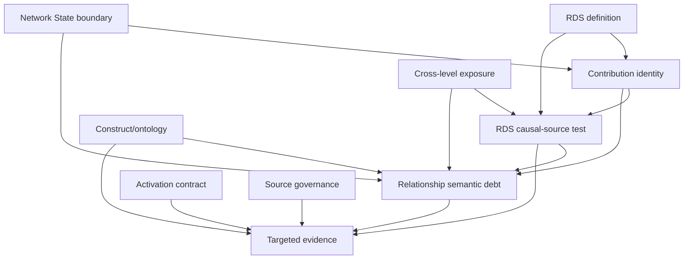

# Post-Scale-Up dependency analysis

**READ-ONLY GOVERNANCE PLANNING — NO SCIENCE, ONTOLOGY, ARCHITECTURE OR LIFECYCLE CHANGE**

The historical backlog retains all 44 rows and all 24 active-execution flags. Dependency normalization yields 10 reusable root issues.

| Normalized type | Original rows |
|---|---:|
| DEPENDENT_BLOCKER | 20 |
| DOWNSTREAM_MANIFESTATION | 4 |
| INACTIVE_BUT_SAFE | 2 |
| SCIENTIFIC_RESEARCH_QUEUE | 8 |
| SEMANTIC_DEBT | 8 |
| SOURCE_DEBT | 2 |

Four rows are downstream manifestations rather than independent decisions: Social H12/H20 derive from the Network State boundary, and the ENV/Tech inactive bundle rows derive from their activation-contract blockers. Biological and Informational identity-only records are inactive but safe because no eligible governed effect exists.

## Root dependencies

The structured dependency map is authoritative. Root dependencies are prerequisites for later decisions; they do not authorize implementation.
